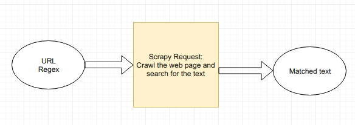

# Crawl URLs and match with regex patterns

## Requirements
- [Task](./cand_prog_task.md)

Take a configured grouped list of urls to check, for each url it must be possible to specify regular expressions that are matched in the content.

The script run daily at 00:00. The period can be changed in the source code at line 80 of [main.py](./main.py). Read [schedule](https://schedule.readthedocs.io/en/stable/index.html) for more details.

Install dependencies:
```
pip install -r requirements.txt
```

This repo uses [Scrapy](https://scrapy.org/) for scraping.

## Usage
```
usage: main.py [-h] [--db-path DB_PATH] -u URL -r REGEX [--input-path INPUT_PATH]

Crawl an url and find matching regex

optional arguments:
  -h, --help            show this help message and exit
  --db-path DB_PATH     Database path, default to db.json
  -u URL                URL to crawl
  -r REGEX              Regex to search in this URL
  --input-path INPUT_PATH
                        (optional) The path to the JSON file contains urls and regexes
```

The sample JSON input file for `--input-path` has the structure:
```
[
  {
    "url": "https://en.wikipedia.org/wiki/Vietnam",
    "regex": "Vietnam(ese)? victory"
  },
  {
    "url": "https://finland.fi/life-society/trauma-portrayed-with-heroism/",
    "regex": "white"
  },
  {
    "url": "https://finland.fi/christmas/christmas2019/",
    "regex": "machine (learning)?"
  }
]

```

### Examples

Search for the regex pattern `\d+` (numbers) of the [URL](https://www.theguardian.com/world/2018/feb/12/safe-happy-and-free-does-finland-have-all-the-answers) and output to `/home/user/test.json`
```
python main.py \
  -u 'https://www.theguardian.com/world/2018/feb/12/safe-happy-and-free-does-finland-have-all-the-answers' \
  -r '\d+' \
  --db-path /home/user/test.json'
```

Specifiy multiple URLs and regex patterns:
```
python main.py \
  -u 'https://www.theguardian.com/world/2018/feb/12/safe-happy-and-free-does-finland-have-all-the-answers' \
  -r '\d+' \
  -u 'https://www.lonelyplanet.com/finland' \
  -r 'Finland'
```

and with JSON input file:
```
python main.py \
  -u 'https://www.theguardian.com/world/2018/feb/12/safe-happy-and-free-does-finland-have-all-the-answers'
  -r '\d+' \
  -u 'https://www.lonelyplanet.com/finland' \
  -r 'Finland' \
  --input-path input.json
```

### Output

The default output is `db.json` using [TinyDB](https://tinydb.readthedocs.io/en/latest/). Each item has the structure:
```
{
  "time": "2019-12-01T22:48:37.718983",
  "url": "https://en.wikipedia.org/wiki/Vietnam",
  "regex": "Vietnam(ese)? victory",
  "matches": [
    {
      "text": "Vietnamese victory",
      "start": 3426,
      "end": 3444
    },
    {
      "text": "Vietnamese victory",
      "start": 3728,
      "end": 3746
    }
  ]
},
```

- `time`: Time crawled
- `url`: URL
- `regex`: Regex pattern
- `matches`: Array  of matches:
  + `text`: Text matched with the regex pattern
  + `start`: The starting position of the matched text in the webpage (after removing all the tags)
  + `end`: The ending position of the matched text in the webpage (after removing all the tags)

## Architecture

A Scrapy request is created for each request to search for the regex pattern and save the matched text to the database.



## Test
```
pytest
```

## Benchmark
